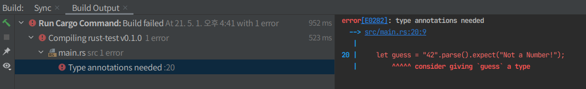
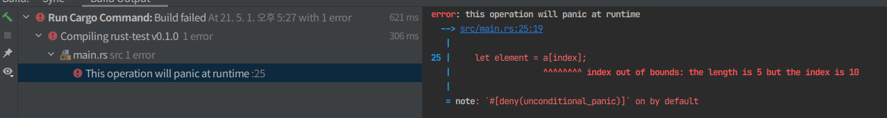

### 데이터 타입들 

- Rust에서 사용되는 모든 값들은 어떤 타입을 가짐 => 어떤 형태의 데이터인지 명시해 Rust에게 알려줘 
    - 데이터를 어떻게 다룰지 알 수 있도록 해야 함 
    - 타입 : 스칼라, 컴파운드

- `Rust는 타입이 고정된 언어` : 모든 변수의 타입이 컴파일 시 반드시 정해져 있어야 한다는 것
```rust
// 컴파일러는 우리가 값을 사용하는지에 따라 타입을 추측할 수 있음 
// String을 Parse를 사용해 숫자로 변환했던 경우처럼 타입의 선택 폭이 넓은 경우는 반드시 타입의 명시를 첨가 
let guess: u32 = "42".parse().expect("Not a Number!");
```

- 타입 명시를 첨가하지 않은 경우 Rust는 에러 발생 

  
## 1. 스칼라 타입들 

1) 정수형 2) 부동소수점 숫자 3) boolean 4) 문자 
  
### 정수형 - 부호된 숫자는 2의 보수 형태를 사용하여 저장됨 
  - 각 부호 변수는 -(2^n-1)~2^(n-1)-1의 값을 포함 ( n : 사용되는 타입의 비트 수 )
  - 미 부호 타입은 0에서 2^n - 1까지의 값을 저장 가능

- isize, usize 타입은 컴퓨터 환경이 64bits인지 아닌지에 따라 결정됨 
  - 64bits 아키텍처면 64bit를, 32bits 아키텍처면 32bit를 갖게 됨 
  
- 정수형 리터럴을 사용할 수 있음 
  - byte 리터럴을 제외하고 모든 정수형 리터럴은 57u8과 같은 타입 접미사 
  - 1_000와 같이 시각적인 구분을 위한 _의 사용을 허용
  
### 부동 소수점 타입 
- Rust의 부동 소수점 타입 f32, f64  => 각각 32bit와 64bit의 크기를 가짐 
    - 기본 타입은 f64 : 최신의 cpu상에선 비슷한 속도를 내면서 더 정밀한 표현이 가능
  
```rust
fn main(){
  let x = 2.0; //f64
  lte y : f32 = 3.0 //f32
}
// 부동소수점 숫자 -= IEEE-754 표준에 따라 표현됨 
```

### 수학적 연산들 - 모든 숫자 타입에 적용됨 
```rust
fn main(){
  
  let sum = 5 + 10;
  
  let difference = 95.5-4.3;
  
  let product = 4 * 30;
  
  let quotient = 56.7/32.2;
  
  let remainder = 43 % 5; 
  
  
}
```

### Boolean 타입 - 둘 중 하나의 값만 가질 수 있음 (true, false)
- bool로 명시됨 
```rust
fn main(){
  let t = true;
  let f: bool = false; // 명시적 타입 어노테이션
}
```

### 문자 타입 - char : 가장 근본적인 알파벳 타입 
- 스트링은 큰따옴표, char 타입은 작은따옴표로 쓰는점 
- `Rust의 char타입은 Unicode Scalar를 표현하는 값` => ASCII보다 더 많은 표현이 가능 

## 복합 타입들 

- 다른 타입의 다양한 값들을 하나의 타입으로 묶을 수 있음 => 튜플, 배열 

### 값들을 집합시켜서 튜플화하기 
- 튜플 : 다양한 타입의 몇 개의 숫자를 집합시켜 하나의 복합 타입으로 만드는 일반적인 방법 
- 콤파로 구분되는 값들의 목록을 작성하여 튜플을 만듬 
- 튜플에 포함되는 각 값의 타입이 동일할 필요없이 서로 달라도 됨 
```rust
fn main(){
  let tup: (i32, f64, u8) = (500, 6.4, 1);
}
```

- 튜플 : 단일 요소를 위한 복합계로 고려됨 => 변수 tup에는 튜플 전체가 bind됨 
  - 개발 값을 튜플의 밖으로 빼내오기 위해서는, 패턴 매칭을 사용해 튜플의 값을 구조해체 시키면 됨
```rust
fn main(){
    let tup  (500, 6.4, 1);
    let (x,y,z) = tup;
    println!("The value of y is {}", y);
}
// 튜플을 만들고 변수 tup에 bind 시킴
// 패턴과 let을 통해 tup을 세개의 분리된 변수 x,y,z에 이동 시킴 
// 구조해체 - 하나의 튜플을 세 부분으로 나누기 때문 
```

- 구조해체에 추가로, 마침표 뒤에 우리가 접근하길 원하는 값의 색인을 넣는 것을 통해 튜플의 요소에 직접적으로 
접근할 수 있음
```rust
fn main(){
  let x: (i32, f64, u8) = (500, 6.4, 1);
  
  let five_hundred = x.0;
  
  let six_point_four = x.1;
  
  let one = x.2;
}

// 튜플의 첫 번재 색인은 0
```

### 배열 - 여러 값들의 집합체를 만드는 다른 방법 
- 튜플과는 다르게, 배열의 모든 요소는 모두 같은 타입이어야 함 
- Rust의 배열 : 배열은 고정된 길이를 갖는다는 점 
```rust
fn main(){
  let a = [1,2,3,4,5];
}
```
- 배열 : 데이터를 힙보다 스택에 할당하는 것을 원하거나 항상 고정된 숫자의 요소를 갖는다고 확신하고 싶을 때 
    - 벡터 타입처럼 가변적이지 않음
    - 벡터 타입 : 유사 집합체 - 표준 라이브러리에서 제공됨 ( 확장 혹은 축소가 가능 )
- 배열이나 벡터 중 뭘 선택해야 할지 확실하지 않은 상황 => 벡터를 사용하도록 하자 

- 배열 요소에 접근하기 : `stack에 단일 메모리 뭉치로 할당됨`
```rust
fn main(){
  
  let a = [1,2,3,4,5];
  
  let first  = a[0];
  let second = a[1];
}
```

- 유효하지 않은 배열 요소에 대한 접근 
```rust
fn main(){
  
  let a = [1,2,3,4,5];
  let index = 10;
  
  let element = a[index];
  
  println!("The value of element is: {}", element);
  
}
```

- 컴파일 시에는 아무런 에러도 발생시키지 않음 => 실행 중에 에러가 발생했고 성공적으로 종료되지 못했다고 나옴

- 프로그램이 오류와 함께 종료될 때 panic

- Rust의 안전 원칙이 동작하는 예
  - 메모리 접근을 허용하고 계속 진행하는 대신 즉시 종료 => 오류로부터 사용자를 보호 


