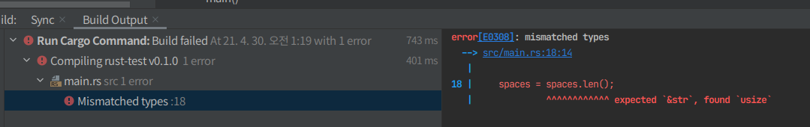

## 2. 보편적인 프로그래밍 개념 

### 변수와 가변성 

- 기본 변수는 불변성 => Rust가 제공하는 안전성 & 손쉬운 동시성 장점을 취할 수 있도록 코드를 작성하게끔 강제하는 요소 중 하나 

### 왜 Rust에서 불변성을 권장하는가??

- 변수가 불변성인 경우 => 값이 이름에 `bound`되면 해당 값을 변경할 수 없음 

```rust
    let x = 5;
    println!("The value of x is: {}", x);
    x = 6;
    println!("The value of x is: {}", x);
```
- 에러가 나타내는 것 => 불변성 변수에 재할당 - 원인 : 우리가 불변성 변수 x에 두 번째로 값을 할당했기 때문 

- 이전에 불변성으로 선언한 것의 값을 변경하고자 하는 시도를 하면 
    - 컴파일 타임의 에러를 얻게 되고 이로 인해 버그가 발생할 수 있기 때문에 중요
    - 만약 우리 코드의 일부는 값이 변경되지 않는 것을 가정하는데??
      - 다른 코드는 이와 다르게 값을 변경한다면? 전자에 해당하는 코드는 우리가 의도한 대로 수행되지 않을 수 있음 
        - 이 경우에 해당하는 코드가 항상 값 변경이 아닌, 가끔 값을 변경하는 경우 나중에 버그 추적이 어려움 
    
- Rust에서는 컴파일러가 변경되지 않은 값에 대한 보증을 해주고, 실제로 이는 바뀌지 않음 
  - 코드를 작성하거나 분석할 시에 변수의 값이 어떻게 변경되는지 추적할 필요가 없기 때문에 코드를 더 합리적으로 만들어줌 
    
- 가변성은 매우 유용하게 사용될 수 있음 
  - 변수는 기본적으로 불변성이지만, 변수명의 접두어로 mut를 추가하는 것을 통해 가변성 변수를 선언할 수 있음
  - 변경을 허용하는 것에 추가로 향후 코드를 보는 사람에게 코드의 다른 부분에서 해당 변수의 값을 변경할 것이라는 의도를 주지시킴 
    
### 에시 
- ex) 대규모 데이터 구조체를 다루는 경우, 가변한 인스턴스를 사용하는 것이 새로 인스턴스를 할당하고 반환하는 것보다 빠를 수 있음 
  - 데이터 규모가 작을수록 새 인스턴스를 생성하고 함수적 프로그래밍 스타일로 작성하는 것이 더 합리적, 
    - 약간의 성능 하락을 통해 가독성을 확보할 수 있다면 더 가치있는 선택 
    
### 변수와 상수 간의 차이점들 

1. 상수에 대해선 `mut`를 사용하는 것이 허용되지 않음
  - 기본 설정이 불변성인 것이 아닌, 불변성 그 자체 
  - let 키워드 대신 const 키워드 사용해야 함 
  - 반드시 값의 유형을 선언해야 한다는 것 

2. 상수는 전체 용역을 포함해 어떤 영역에서도 선언될 수 있음 
  - 코드의 많은 부분에서 사용될 필요가 있는 값을 다루는데 유용 

3. 상수는 오직 상수 표현식만 설정될 수 있지, 함수 호출의 결과값이나 그 외에 실행 시간에 결정되는 값이 설정될 수는 없다는 말 
```rust
const MAX_POINTS : u32 = 100_000;
```
- 상수는 자신이 선언되어 있는 영역 내에서 프로그램이 실행되는 시간 동안 항상 유효
  - 프로그램 전체에 걸쳐 하드코드 해야 하는 값을 이름지어 상수로 사용 
    - 유지보수 하게 될 사람에게 그 의미를 전달할 수 있으므로 유용
  - 향후 해당 값을 변경해야 하는 경우 - 상수로 선언된 값 한 곳만 변경하면 됨 
    

### Shadowing

- 이전에 선안한 변수와 같은 이름의 새 변수를 선언할 수 있고 & 새 변수는 이전 변수를 shadows하게 됨 
  - 첫 번수가 두 번째에 의해 shadowed 됐다고 표현하게 됨 -> 해당 변수명은 두 번째 변수의 값을 갖게 된다는 뜻

- let 키워드를 사용해 
```rust
fn main(){
    let x = 5;  // x에 값 5를 bind
    let x = x + 1; // let x = 구문으로 x를 shadow하고 원본값에 +1해 x의 값은 6이 됨 
    let x = x * 2; // let x = 구문으로 x를 shadow하고 원본값에 *2해 x의 값은 12이 됨
    
    println!("The value of x is: {}" ,x);
}
```

1. 위와 같은 사용은 mut으로 선언하는 것과는 차이가 있게 됨 
  - let 키워드를 사용하지 않고 변수에 새로 값을 대입하려고 하면 컴파일 시에 에러를 얻게 되기 때문 
    - 몇 번 값을 변경할 수는 있지만, 그 이후에 변수는 불변성을 갖게 됨 

2. let 키워드를 다시 사용해 효과적으로 새 변수를 선언하고, 값의 유형을 변경할 수 있으면서도 동일 이름을 사용할 수 있다는 점 
  - ex) 공백 문자들을 입력받아 얼마나 많은 공백 문자가 있는지 보여주고자 할 때, 실제로는 저장하고자 하는 것은 공백의 개수 
```rust
  let spaces = "    ";
  let spaces =  spaces.len();
```
- 이와 같은 구조가 허용되는 이유
  1. 첫 spaces 변수가 문자열 유형, 두 번째 spaces 변수는 첫 번째 것과 동일한 이름을 가진 새롭게 정의된 숫자 유형의 변수 
    - shadowing은 대채된 이름을 사용하는 대신 재사용할 수 있게 해줌 
- 그러나 mut를 사용하려고 했다면?
  - 변수의 유형을 변경할 수 없다는 컴파일 에러를 얻게 됨
```rust
let mut spaces = "    ";
spaces = spaces.len();
```



   