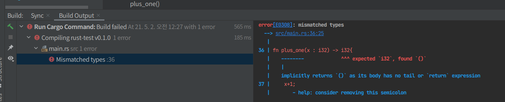

# 함수 동작 원리 

- Rust 코드 : snake_case ( 명명 관례 - 모든 글자는 소문자로 표기, 단어는 띄어쓰기 대신 밑줄로 연결 )

- 함수 선언 : fn으로 시작 > 함수 이름뒤에 괄호의 형식으로 되어 있음 

- Rust는 함수의 위치를 신경쓰지 않음 => 정의만 되어 있으면 됨 

## 함수 매개변수 
- 매개변수를 취할 때 => 상수를 전달인자로 제공 가능 
- 전달 인자 vs 매개변수를 헷갈릴 수 있음 
```rust
fn main(){
    another_function(5);
}

fn another_function(x: i32){ // x로 명명된 하나의 매개변수를 가짐 
    println!("The value of x is: {}", x); //println! 매크로는 중괄호 짝으로 된 형식 문자열에 5를 전달 
}
```
- 함수의 선언부에서 반드시 각 매개변수의 타입을 정의해야 함 
    - 함수의 정의에 타입을 명시에 코드 내 다른 부분에서 이들을 사용하는 것을 통해 의도를 추측하지 않아도 되게 됨 
    
## 함수 본문 
- 표현식으로 종결되는 구문의 나열(구문 : 명령들의 나열)
- 구문 vs 표현식 
    - 표현식은 결과 값을 산출해냄 , 구문은 값을 반환하지 않는 어떤 동작을 수행
```rust
fn main(){
    let y = 6; // 구문은 값을 반환하지 않음 
    let x = (let y = 6); // Error
}
```
- let y = 6 구문은 반환 값이 없어, x에 bind 시킬 것이 없음 => c나 ruby와의 차이점 

- 표현식은 구문의 부분일 수 있음 
    - let y = 6 : 6은 6이란 값을 산출하는 표현식
    
- 함수를 호출하는 것은 표현식, 매크로를 호출하는 것은 표현식 
- `새로운 범위를 생성하는 데 사용되는 block도 표현식`

```rust
fn main(){
    
    let x = 5;
    let y = {
      let x = 3;
      x + 1
    };
  
    println!("The value of y is: {}", y);
}
```
```rust
// 표현식 부분 
{
let x = 3;
x + 1
}
```
- 이 해당 블록은 4를 산출 => let 구문의 일부로 y에 bound 됨 
- `x+1 줄이 세미콜론으로 끝나지 않은 점을 주목!`
- `표현식은 종결을 나타내는 세미콜론을 사용하지 않음`
  - `만약 세미콜론을 표현식 마지막에 추가하면, 구문으로 변경되고 반환 값이 아니게 됨`
  
### 반환 값을 갖는 함수 
- 함수는 그들을 호출한 코드에 값을 반환, 반환되는 값을 명명해야 할 필요는 없지만
- 그들의 타입은 `->` 뒤에 선언해야 함 
- Rust에서의 반환값 : 함수 본문의 마지막 표현식의 값과 동일 
- return  키워드와 값을 써서 함수로부터 일찍 반환할 수 있지만,
  - 대부분의 함수들은 암묵적으로 마지막 표현식을 반환
```rust
fn five() -> i32 {
  5
} // five 함수 - 함수 호출, 매크로, let 구문도 없음 => 그런데도 함수로 허용 

fn main(){
  
  let x = five(); 
  
  println!("The value of x is: {}", x);
  
  
}
```
- `let x = five();` : 반환 값을 변수의 초기값으로 사용하는 것을 보여줌 
- 매개변수 없이 반환 값에 대한 타입만 정의되어 있음 => 5만이 세미콜론 없이 외로이 있는 이유 
   - 우리가 값을 반환하고자 할 때 사용하는 표현식 
  
```rust
fn main() {
  let x = plus_one(5);

  println!("The value of x is : {}", x);
}

fn plus_one(x : i32) -> i32{
  x+1;
}
```

- mismatched Types - 이 코드의 주요 문제 
- plus_one 함수의 정의 : i32를 반환하겠다고 하였지만, 구문은 값을 산출하지 않아 => ()처럼 비어있는 튜플로 표현됨 
- 반환할 것이 없어 함수가 정의된 내용과 상충하게 되고 에러를 발생시킴 

