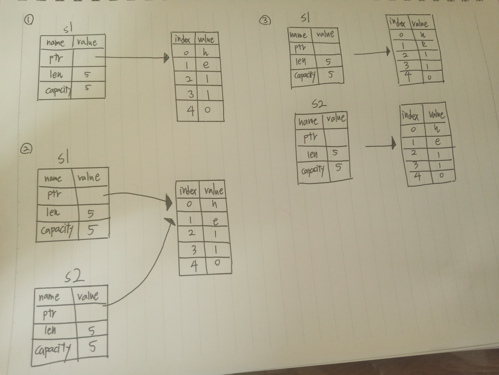
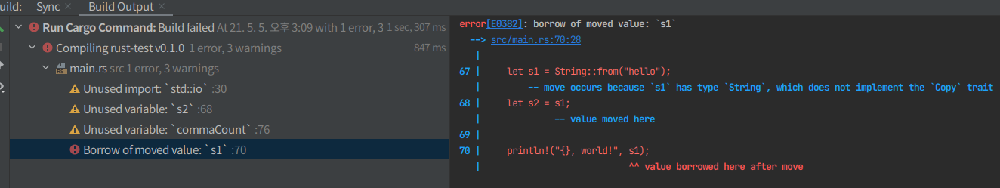

# 소유권 

- 러스트의 가장 유니크한 특성 
- 러스트가 가비지 콜렉터 없이 메모리 안정성 보장을 하게 해줌 

---

## 소유권?

- 러스트의 핵심 기능, 직관적 설명 가능(언어의 나머지 부분에 깊은 영향을 끼침)

- 모든 프로그램 - 실행하는 동안 컴퓨터의 메모리를 사용하는 방법을 관리해야 함 

    - 몇몇 언어들 - 프로그램이 실행될 때 더 이상 사용하지 않는 메모리를 끊임없이 찾는 가비지 콜렉션을 갖고 있음 
    
    - 다른 언어들 - 프로그래머가 직접 명시적으로 메모리를 할당하고 해제행 ㅑ함 
    
- 러스트의 제 3의 접근법 

    - 메모리는 컴파일 타임에 컴파일러가 체크할 규칙들로 구성된 소유권 시스템을 통해 관리됨 
    
    - 소유권 기능들의 어떤 것도 런타임 비용이 발생하지 않음 
    
    - 러스트, 소유권 시스템의 규칙에 더 많은 경험 
        
        - 더 안전하고 더 효율적인 코드를 자연스럽게 개발할 수 있게될 것
    
- 이 장에서는 문자열에 집중된 예제를 확인해보자!

### 스택과 힙 

- 많은 프로그래밍 언어들 중, 스택과 힙에 대해 자주 생각할 필요가 없음 

- 그러나 Rust와 같은 시스템 프로그래밍 언어 
    
    - 값이 스택에 있는지, 힙에 있는지의 여부가 언어의 동작 방식과 우리의 결단에 더 큰 영향을 줌 
    
- 스택과 힙 둘 다 코드 상에서 런타임에 사용할 수 있는 메모리의 부분 
    - 각기 다른 방식으로 구조화되어 있음 
    
- 스택 : 값을 받아들인 순서대로 값을 저장하고 반대 방향으로 값을 지움 
    - last in, first out
    - 데이터를 추가 : 스택에 푸시, 데이터를 제거 : 스택을 팝하기 
    
- `스택은 데이터에 접근하는 방식 덕택에 빠름`
    - `새로운 데이터를 넣어두기 위한 공간 or 데이터를 가져올 공간을 검색할 필요가 전혀 없음`
    - `바로 그 공간이 항상 스택의 꼭대기(top)이기 때문`
- `스택을 빠르게 해주는 또 다른 특성` : `스택에 담긴 모든 데이터가 결정되어 있는 고정된 크기를 갖고 있어야 한다는 점`

- `컴파일 타임에 크기가 결정되어 있지 않거나 크기가 변경될 수 있는 데이터를 위해서는`
    - `힙에 데이터를 저장할 수 있음`

- 복잡한 힙의 과정 
    - `데이터를 힙에 넣을 때, 1) 먼저 저장할 공간이 있는지 물어봄`
    - `2) 그러면 운영체제가 충분히 커다란 힙 안의 빈 어떤 지점을 찾아서 이 곳을 사용중이라고 표시하고,`
        - `해당 지점의 포인터를 우리에게 돌려줌` => 힙 공간 할당하기(할당)
        - 스택에 포인터를 푸싱하는 것은 할당에 해당되지 않음 
    - 포인터는 결정되어 있는 고정된 크기의 값 => 우리는 스택에 포인터를 저장할 수 있지만, 
        - 실제 데이터를 사용하고자 할 때는 포인터를 따라가야 함 
    
- `힙에 저장된 데이터에 접근하는 것은 스택에 저장된 데이터에 접근하는 것보다 느림`
    - `그 이유는 포인터가 가리킨 곳을 따라가야 하기 때문`
    - 현대 프로세서들은 메모리 내부를 덜 뛰어다닐 때 더 빨라짐 
    - 프로세서는 (힙에 있는 데이터와 같이) 멀리 떨어져 있는 데이터들 보다는 
        - (스택에 있는 것과 같이) 붙어있는 데이터들에 대한 작업을 하면 더 빨라짐
    - 힙으로부터 큰 공간을 할당받는 것 또한 시간이 걸릴 수 있음
    
- 코드의 어느 부분이 힙의 어떤 데이터를 사용하는지 추적하는 것
- 힙의 중복된 데이터의 양을 최소화 하는 것
- 힙 내에 사용하지 않는 데이터르 ㄹ제거하여 공간이 모자라지 않게 하는 것

- 위의 3가지 경우 모두, 소유권과 관계된 문제들
    - 힙 데이터를 관리하는 것이 곧 소유권의 존재 이유
    
## 소유권 규칙 

### 1. 러스트의 각각의 값은 해당 값의 owner라고 불리우는 변수를 갖고 있다 
### 2. 한 번에 딱 하나의 오너만 존재할 수 있다 
### 3. 오너가 스코프 밖으로 벗어나는 때, 값은 버려진다(dropped)

## 변수의 스코프

- 변수 s는 스트링 리터럴을 나타냄(스트링 리터럴의 값은 프로그램 텍스트 내에 하드코딩되어 있음)
- 변수는 선언된 시점부터 현재의 스코프가 끝날 때까지 유효함 
```rust
{
    // s는 유효하지 않음, 아직 선언이 되지 않음  
    let s = "hello"; // s는 이 지점부터 유효

    // s를 가지고 뭔가 함
}    // 이 스코프는 이제 끝, s는 더 이상 유효하지 않음 
```

- 두 가지 중요한 지점
    - `1. 스코프 안에서 s가 등장하면, 유효합니다.`
    - `2. 이 유효기간은 스코프 밖으로 벗아날 때까지 지속됨`
    
- 스코프와 변수가 유효한 시점 간의 관계는 다른 프로그래밍 언어와 비슷

### String 타입 

- 이전에 봤던 모든 데이터 타입들 - 스택에 저장되었다가 스코프를 벗어날 때 스팩으로부터 팝 됨 
    - 그러면 힙에는 무슨 데이터가 저장되고, 러스트는 이 데이터를 어떻게 비워내는가?
    
- 스트링 리터럴 => 프로그램 안에 하드코딩 되어 있음 
- 문자열 값은 편리하지만, 텍스트를 필요로 하는 모든 경우에 대해 항상 적절하지 않음 
    - `이유 1: 문자열 값은 불변!(immutable)`
    - `이유 2: 모든 문자열이 프로그래밍 하는 시점에서 다 알 수 있는 것이 아님`
        - 사용자의 입력을 받아 저장하고 싶다면? 
    
- 위와 같은 경우들에 대해, Rust는 두 번쩨 문자열 타입은 String을 지원 
    - 이 타입은 힙에 할당되고, 컴파일 타임에는 우리가 알 수 없는 양의 텍스트를 저장할 수 있음
```rust
// 스트링 리터럴부터 from이라는 함수를 이용해 String을 아래처럼 만들 수 있음 
let s = String::from("hello");
  
```

- 더블 콜론(::) : String 타입 아래의 from 함수를 특정지을 수 있도록 해주는 네임스페이스 연산자 
    - 메소드 문법
    
- 이러한 종류의 문자열은 변경 가능함 

```rust

let mut s = String::from("hello");

s.push_str(", world!"); // push_str()은 해당 스트링 리터럴을 스트링에 붙여줌

println!("{}", s); // 이 부분이 "hello, world!"를 출력할 것 

```

- `String은 변할 수 있는데, 스트링 리터럴은 안 될까??`
    - `차이점 : 두 타입이 메모리를 쓰는 방식`
    
### 메모리와 할당 

- 스트링 리터럴의 경우, 내용물을 컴파일 타임에 알 수 있음 
    - 텍스트가 최종 실행파일에 직접 하드코딩되었음 => 스트링 리터럴이 빠르고 효율적이 됨
    - 이는 문자열이 변경되지 않는 것을 전제로 하는 특성 
    - 불행히, 컴파일 타임에 크기를 알 수 없는 경우 & 실행 중 크기가 변할 수도 있는 경우의 텍스트 조각을 바이너리 파일에 집어넣을 수 없음 
    
- String 타입 : 변경 가능하고 커질 수 있는 텍스트를 지원하기 위해 만들어짐 
    - 힙에서 컴파일 타임에는 알 수 없는 어느 정도 크기의 메모리 공간을 할당받아 내용물을 저장할 필요가 있음
    
### 1. 런타임에 운영체제로부터 메모리가 요청되어야 한다.
### 2. String의 사용이 끝났을 때 운영체제에게 메모리를 반납할 방법이 필요하다

1) 우리가 직접 수행 -> String::from을 호출하면, 구현부분에서 필요한 만큼의 메모리를 요청함
    - 프로그래밍 언어들 사이에서 매우 일반적
2) 이 경우는 다름 - 가비지 콜렉터(GC)를 갖고 있는 언어들의 경우, GC가 더 이상 사용하지 않는 메모리 조각을
    - 계속해서 찾고 지워주며, 우리는 프로그래머로서 이와 관련된 생각을 안해도 됨 
    - GC가 없을 경우, 할당받은 메모리가 더 필요없는 시점을 알아서 명시적으로 이를 반납하는 코드를 호출하는 것은 프로그래머의 책임 
    - 잊어먹으면? 메모리를 낭비하는 것
    - 너무 빨리 반납해버리면? 유효하지 않은 변수를 갖게 됨 
    - 만일 반납을 두 번하면? 버그 
    - 우리는 딱 한번의 allocate와 한 번의 free 쌍을 사용해야 함 
    
- 러스트는 다른 방식으로 문제를 해결
    - `메모리는 변수가 소속되어 있는 스코프 밖으로 벗어나는 순간 자동으로 반납됨`
```rust
{
    let s = String::from("hello"); // s는 여기서부터 유효함
    
    // s를 가지고 뭔가 함 

}               // 이 스코프는 끝났고, s는 더 이상 유효하지 않음
```

- `String이 요구한 메모리를 운영체제에게 반납하는 자연스러운 지점이 존재`
    - s가 스코프 밖으로 벗어날 때 
    - 변수가 스코프 밖으로 벗어나면, 러스트는 우리를 위해 특별한 함수를 호출
        - `drop이라 부르고, String의 개발자가 메모리를 반환하도록 하는 코드를 집어넣을 수 있음`
- `러스트는 } 괄호가 닫힐 때 자동적으로 drop을 호출`
    
### RAII??

- C++ 에서는 이렇게 아이템의 수명주기의 끝나는 시점에 자원을 해제하는 패턴 
    - 자원 습득이 곧 초기화(Resource Acquisition is Initialization, RAII)라고 부름 
    - 러스트의 drop 함수는 RAII 패턴을 경험해본 적 있다면 익숙할 것
    
- 이 패턴 => 러스트 코드가 작성되는 방법에 깊은 영향을 줌 
    - 힙에 할당시킨 데이터를 사용하는 여러 개의 변수를 사용하고자 할 경우와 같이 좀 더 복잡한 상황에서 
        - 코드의 동작은 예기치 못할 수 있음

### 변수와 데이터가 상호작용하는 방법: 이동(move)

- 여러 개의 변수들은 러스트에서 서로 다른 방식으로 같은 데이터에 대해 상호작용할 수 있음 
```rust
    // 변수 x의 정수값을 y에 대입하기
    let x = 5;
    let y = x;
```
- "정수값 5를 x에 묶어놓고, x의 값의 복사본을 만들어 y에 묶는다."
    - 이제 x와 y 두 개의 변수를 갖게 되었고, 둘 다 5와 같음 
    - 정수값이 결정되어 있는 고정된 크기의 단순한 값, 5라는 값들이 스택에 푸쉬되기 때문에, 실제로도 이렇게 됨 
    
```rust

    // String 버전
    let s1 = String::from("hello");
    let s2 = s1;
```

- 이전의 코드랑 매우 유사해 보임 => 동작하는 방식도 동일할 것이라고 가정할 지도 모름 
    - 즉, 두 번째 줄이 s1의 복사본을 만들어서 s2에 묶어놓는 식으로 말이지 
    - 그렇지만, 이는 실제 동작과 다른 생각 
    
- String은 세 개의 부분으로 이루어짐 
    - 문자열의 내용물을 담고 있는 메모리의 포인터, 길이, 용량
    - `이 데이터의 그룹은 스택에 저장됨` 
    - `내용물을 담은 오른쪽의 것은 힙 메모리에 저장됨`



- 길이 값 - 바이트 단위 : String의 내용물이 얼마나 많은 메모리를 현재 사용하고 있는지 말함 
- 용량 값 - 바이트 단위 : String이 운영체제로부터 얼마나 많은 양의 메모리를 할당받았는지를 말함


- `s2에 s1을 대입하면, String 데이터가 복사됨`
    - `이는 스택에 있는 포인터, 길이, 용량이 복사된다는 의미`
    - `포인터가 가리키고 있는 힙 메모리 상의 데이터는 복사되지 않음`
    

- 변수가 스코프 밖으로 벗어날 때, 러스트는 자동적으로 drop 함수를 호출해 해당 변수가 사용하는 힙 메모리를 제거

- 2번 그림에서, 두 데이터 포인터가 모두 같은 고을 가리키고 있는 것이 보임 
    - 문제가 됨 
    - s2, s1이 스코프 밖으로 벗어나게 되면, 둘 다 같은 메모리를 해제하려 할 것 
        - `두 번 해제(double free)` 오류라고 알려져 있음 
            - 메모리 안정성 버그들 중 하나 
    
- 메모리를 두 번 해제하는 것 - 메모리 손상(memory corruption)의 원인이 됨 
    - 보안 취약성 문제를 일으킬 가능성이 있음 
    

- 메모리 안정성을 보장하기 위해, 러스트에는 한 가지 더 디테일이 존재 
    - 할당된 메모리를 복사하는 것을 시도하는 대신, `러스트에서는 s1이 더 이상 유효하지 않다고 간주하고,`
        - 그러므로 러스트에선 s1가 스코프 밖으로 벗어났을 때 아무것도 해제할 필요가 없어짐
    
```rust
    // s1을 s2가 만들어진 후에 사용하려고 할 때 어떤 일이 벌어지는가?
    let s1 = String::from("hello");
    let s2 = s1;

    println!("{}, world!", s1);
```

- 위 코드는 에러 발생, 러스트가 우리로부터 유효하지 않은 참조자를 사용하는 것을 막기 위함 



### 얕은 복사, 깊은 복사 vs 이동

- 다른 언어로 프로그래밍 하는 동안 얕은 복사와 깊은 복사라는 용어 

    - 데이터의 복사 없이 포인터와 길이, 용량값만 복사한다는 개념이 비슷해 보일 수 있음 
    
    - 러스트는 첫 번째 변수를 무효화시키기도 하기 때문
    
    - 러스트에서는 얕은 복사라고 부르는 대신 이동이라고 말함 
    
        - 예) 위의 코드는 s1이 s2로 이동되었다고 말하는 식으로 위 코드를 읽음 

- s1이 무효화된 후의 메모리 구조 => 우리 문제를 해결해 줌 
    
    - `s2만 유효한 상황에서, 스코프 밖으로 벗어나면 혼자 메모리를 해제할 것이고, 일이 잘 처리되겠음`
    
    - 러스트는 결코 자동적으로 여러분의 데이터에 대한 깊은 복사본을 만들지 않을 것
    
### 변수와 데이터가 상호작용하는 방법 : 클론

- String의 스택 데이터 만이 아니라, 힙 데이터를 깊이 복사하기를 정말 원한다면, clone이라는 공용 메소드를 사용할 수 있음 
```rust
    let s1 = String::from("hello");
    let s2 = s1.clone();

    println!("s1 = {}, s2 = {}", s1, s2);
```
- 힙 데이터가 정말로 복사되는 동작을 명시적으로 만들어 낼 수 있는 방법 

- clone을 호출하는 부분을 보면, 어떤 비용이 많이 들어갈지도 모르는 코드가 실행되는 중이라는 것 알 수 있게 됨
    - 무언가 다른 동작이 수행되는 것을 알려주는 시각적인 지시자
    
### 스택에만 있는 데이터 : 복사 
```rust
    let x = 5;
    let y = x;

    println!("x = {}, y = {}", x, y);
```
- clone을 호출하지 않았지만, x도 유효하며 y로 이동하지도 않았음 

- `정수형과 같이 컴파일 타임에 결정되어 있는 크기의 타입은 스택에 모두 저장되기 때문`
    - 실제 값의 복사본이 빠르게 만들어질 수 있음 
    - 이는 변수 y가 생성된 후에 x가 더 이상 유효하지 않도록 해야할 이유가 없다는 뜻
        - 여기서는 깊은 복사와 얕은 복사 간의 차이가 없다는 것
        - clone을 호출하는 것이 보통의 얕은 복사와 아무런 차이점이 없어 그냥 버릴 수 있음 
    
- Rust는 스택에 저장할 수 있는 타입(정수형 등)에 대해 달 수 있는 Copy 트레잇이라는 특별한 어노테이션을 가짐 
    
    - 만일 어떤 타입이 Copy 트레잇을 갖고 있다면, 대입 과정 후에도 예전 변수를 계속 사용할 수 있음 
    
    - 만일 그 타입 혹은 그 타입이 가지고 있는 부분 중, Drop 트레잇을 구현한 것이 있다면? 
            
        - COPY 트레잇을 어노테이션 할 수 없게끔 함 
    
    - 만일 어떤 타입이 스코프 밖으로 벗어났을 때, 어떤 특수한 동작을 필요로 하고 우리가 그 타입에 대해 Copy 어노테이션을 추가한다면
        - 컴파일 오류를 보게 될 것 
    
- 일반적인 규칙 : 단순한 스칼라 값들의 묶음은 Copy가 가능하고, 할당이 필요하거나 어떤 자원의 형태인 경우 Copy를 사용할 수 없음 

    - 모든 정수형 타입들 - u32 etc..
        
    - 부울린 타입 : bool

    - 모든 부동 소수점 타입들 - f64 ...
    
    - Copy가 가능한 타입만으로 구성된 튜플들 
        
        - (i32, i32) : Copy 가능 / (i32, String) : Copy 불가
    
### 소유권과 함수 

- 함수에게 값을 넘기는 의미론은 값을 변수에 대입하는 것과 유사 

- 함수에게 변수를 넘기는 것은 대입과 마찬가지로 이동하거나 복사될 것 

```rust
fn main(){
    
    let s = String::from("hello"); // s가 스코프 안으로 들어왔습니다.
    
    takes_ownership(s); // s의 값이 함수 안으로 이동했습니다..
                        // ... 그리고 이제 더 이상 유효하지 않습니다.,
    let x = 5;          // x가 스코프 안으로 들어왔습니다. 
    
    makes_copy(x);      // x가 함수 안으로 이동했지만, i32는 copy가 되므로, x를 이후에 계속 사용해도 됨

} // 여기서 x는 스코프 밖으로 나가고, s도 그 후 나감, 하지만 s는 이미 이동되었으므로, 별다른 일이 발생하지 않음

fn takes_ownership(some_string: String) { // some_string이 스코프 안으로 들어옴
    println!("{}", some_string); /
} // 여기서 some_string이 스코프 밖으로 벗어났고 drop이 호출됨, 메모리는 해제됨 

fn makes_copy(some_integer: i32){ // some_integer이 스코프 안으로 들어옴
    println!("{}", some_integer);
} // 여기서 some_integer가 스코프 밖으로 벗어났음, 별다른 일은 발생하지 않음
```
- 만일 우리가 s를 takes_ownership 함수를 호출한 이후에 사용하려 한다면,
    - 러스트는 컴파일 타임 오류를 낼 것 
    
- 이러한 정적 확인은 여러 실수들을 방지해 줌

### 반환 값과 스코프 

- 값의 반환도 소유권을 이동시킴 

```rust
fn main(){
    
    let s1 = gives_ownership(); // gives_ownership은 반환값을 s1에게 이동시킴
    
    let s2 = String::from("hello"); // s2가 스코프 안에 들어왔음 
    
    let s3 = takes_and_gives_back(s2); // s2는 takes_and_gives_back 안으로 이동되었고,
                                    // 이 함수가 반환값을 s3으로도 이동시켰음
} // 여기서 s3는 스코프 밖으로 벗어났으며 drop이 호출됨
    // s2는 스코프 밖으로 벗어났지만 이동되었으므로 아무 일도 일어나지 않음 
    // s1은 스코프 밖으로 벗어나서 drop이 호출됨 

fn gives_ownership() -> String {        // gives_ownership 함수가 반환 값을 호출한 쪽으로 이동시킴
    
    let some_string = String::from("hello"); // some_string이 스코프 안에 들어왔음
    
    some_string // some_string이 반환되고, 호출한 쪽의 함수로 이동됨
}

// takes_and_gives_back 함수는 String을 하나 받아서 다른 하나를 반환함
fn takes_and_gives_back(a_string: String) -> String { // a_string이 스코프 안으로 들어왔음
        
    a_string // a_string은 반환되고, 호출한 쪽의 함수로 이동됨 
}
```

- `변수의 소유권은 모든 순간 똑같은 패턴을 따름` 
    - `어떤 값을 다른 변수에 대입하면 값이 이동됨` 
    - `힙에 데이터를 갖고 있는 변수가 스코프 밖으로 벗어나면,`
        - `해당 값은 데이터가 다른 변수에 의해 소유되도록 이동하지 않는 한 drop에 의해 제거될 것`

- 모든 함수가 소유권을 가졌다가 반납하는 것은 조금 지루해 보임 
    - 만일 함수에게 값을 사용할 수 있도록 하되, 소유권은 갖지 않도록 하고 싶다면??
    - 함수의 본체로부터 얻어진 결과와 더불어 우리가 넘겨주고자 하는 어떤 값을 다시 쓰고 싶어서 함께 반환받아야 한다면, 매우 짜증남
        
        - 튜플을 이용해 여러 값을 돌려받는 식으로 가능하긴 함 => 과한 작업
    
    - 러스트는 이르 ㄹ위한 기능을 갖고 있음 => 참조자(references)라고 부름 
    
    


